# Requestty


[](https://crates.io/crates/requestty)
[](./LICENSE)
[](https://docs.rs/requestty)

`requestty` (request-tty) is an easy-to-use collection of interactive
cli prompts inspired by [Inquirer.js](https://github.com/SBoudrias/Inquirer.js).

- Easy-to-use - The builder API and macros allow you to easily configure
  and use the in-built prompts.

- Extensible - Easily create and use custom prompts with a companion
  ui rendering library.

- Flexible - All prompts can be used standalone or chained together.

- Dynamic - You can dynamically decide what questions should be asked
  based on previous questions.

- Validation - You can validate user input with any prompt.

- Examples - Every prompt is accompanied with an example as well as other
  [examples](./examples) for more complex workflows

## Usage

Add this to your `Cargo.toml`

```toml
[dependencies]
requestty = "0.3.0"
```

```rust
let question = requestty::Question::expand("overwrite")
    .message("Conflict on `file.rs`")
    .choices(vec![
        ('y', "Overwrite"),
        ('a', "Overwrite this one and all next"),
        ('d', "Show diff"),
    ])
    .default_separator()
    .choice('x', "Abort")
    .build();

println!("{:#?}", requestty::prompt_one(question));
```

## In-built prompts

There are 10 in-built prompts:

- ### Input

  Prompt that takes user input and returns a `String`.

  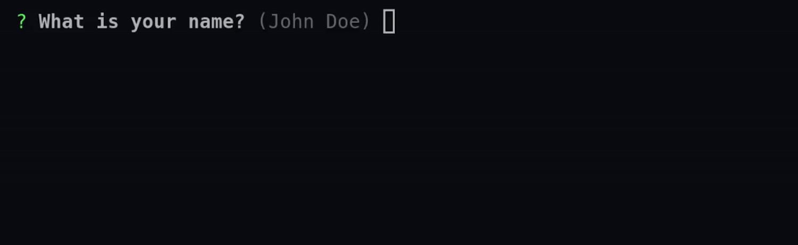

- ### Password

  Prompt that takes user input and hides it.

  <div align="center">
    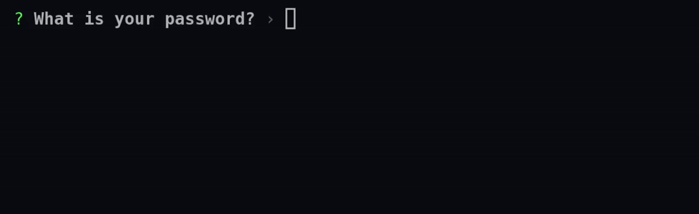
    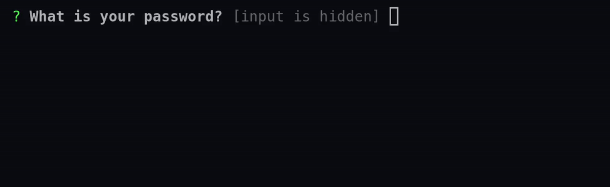
  </div>

- ### Editor

  Prompt that takes launches the users preferred editor on a temporary
  file

  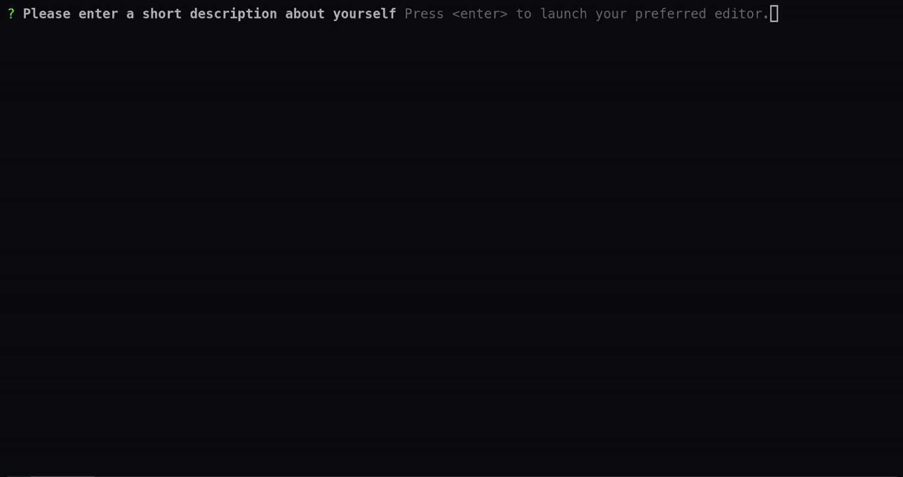

- ### Confirm

  Prompt that returns `true` or `false`.

  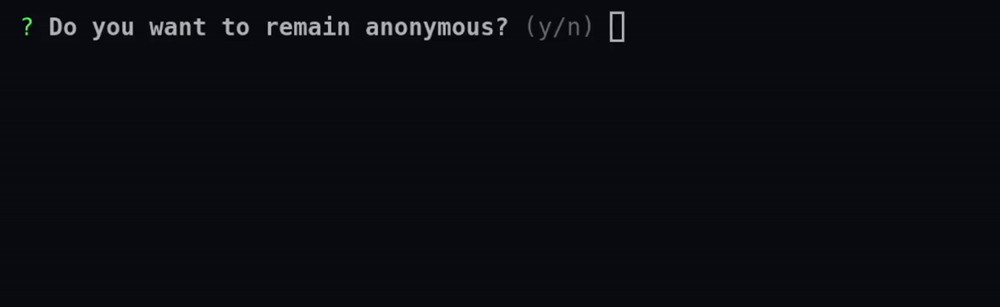

- ### Int

  Prompt that takes a `i64` as input.

  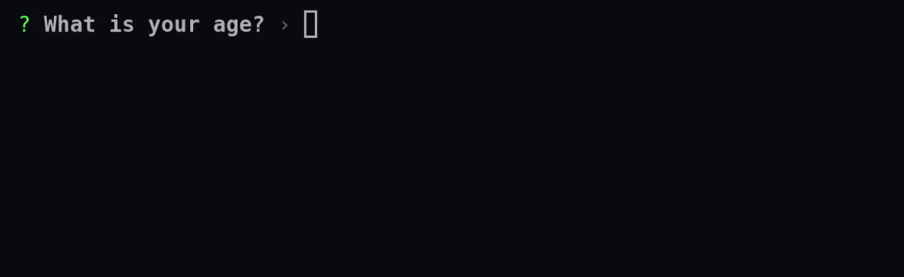

- ### Float

  Prompt that takes a `f64` as input.

  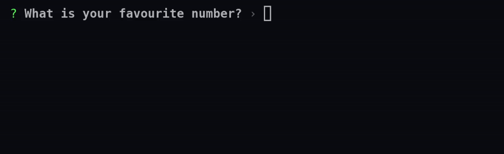

- ### Expand

  Prompt that allows the user to select from a list of options by key

  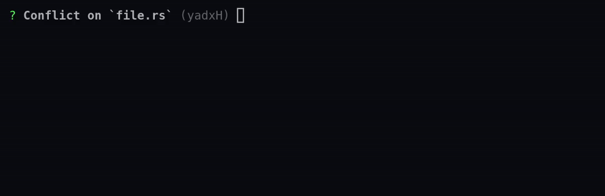

- ### Select

  Prompt that allows the user to select from a list of options

  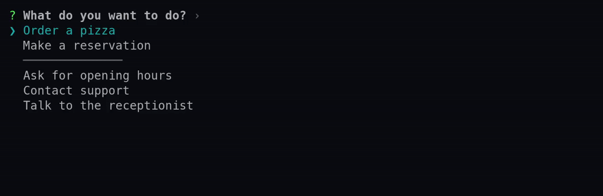

- ### RawSelect

  Prompt that allows the user to select from a list of options with
  indices

  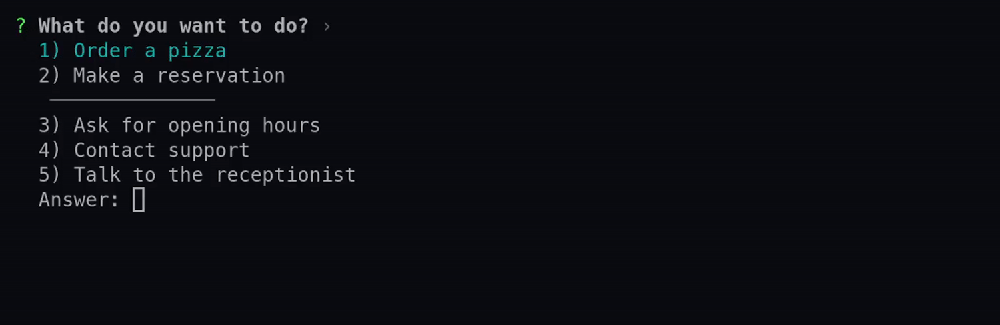

- ### MultiSelect

  Prompt that allows the user to select multiple items from a list of
  options

  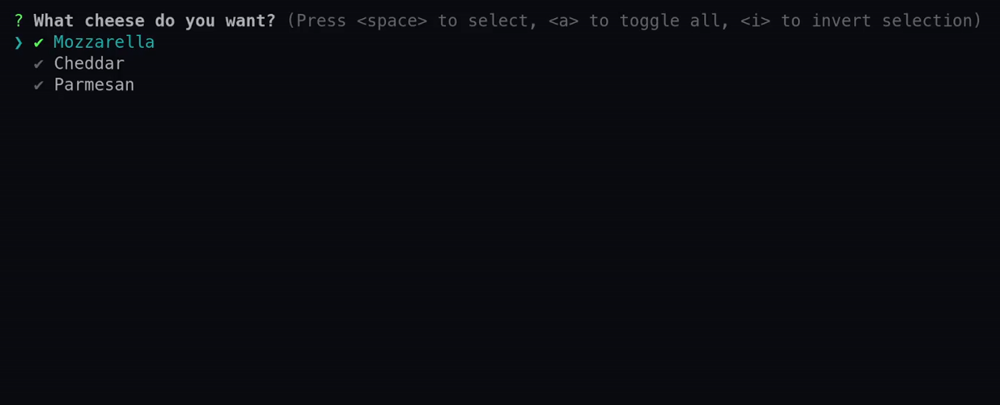

## Optional features

- `macros`: Enabling this feature will allow you to use the `questions`
  and `prompt_module` macros.

- `smallvec` (default): Enabling this feature will use
  [`SmallVec`](https://docs.rs/smallvec/1.6.1/smallvec/struct.SmallVec.html)
  instead of `Vec` for auto completions. This allows inlining single
  completions.

- `crossterm` (default): Enabling this feature will use the
  [`crossterm`](https://crates.io/crates/crossterm) library for terminal
  interactions such as drawing and receiving events.

- `termion`: Enabling this feature will use the
  [`termion`](https://crates.io/crates/termion) library for terminal
  interactions such as drawing and receiving events.

## Minimum Supported Rust Version (MSRV)

Minimum supported rust version (as per
[cargo-msrv](https://crates.io/crates/cargo-msrv)) is `1.49`
